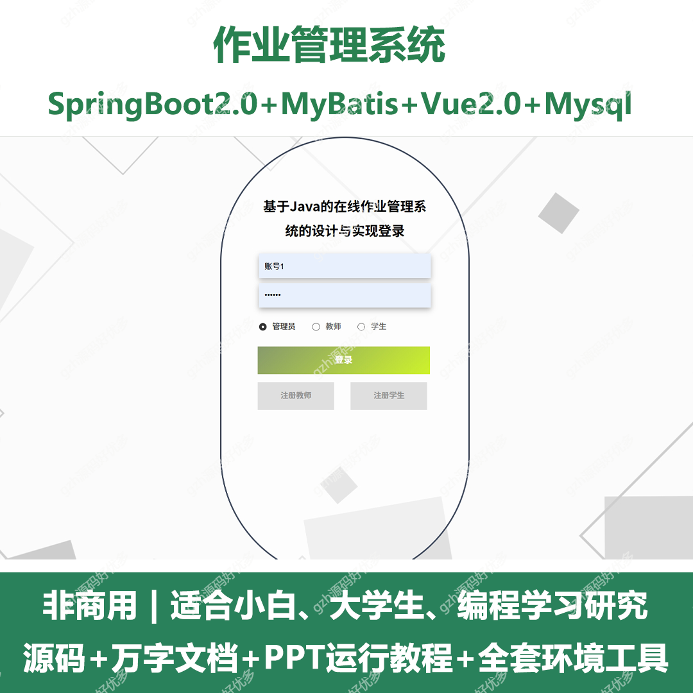
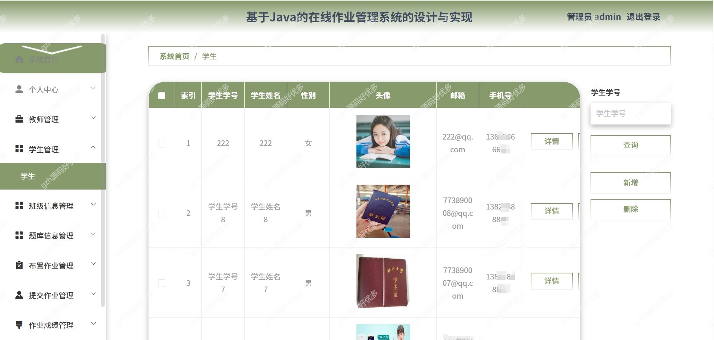
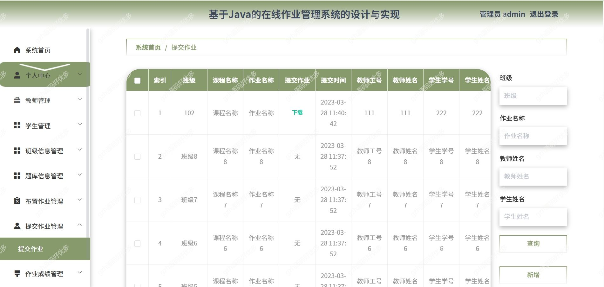
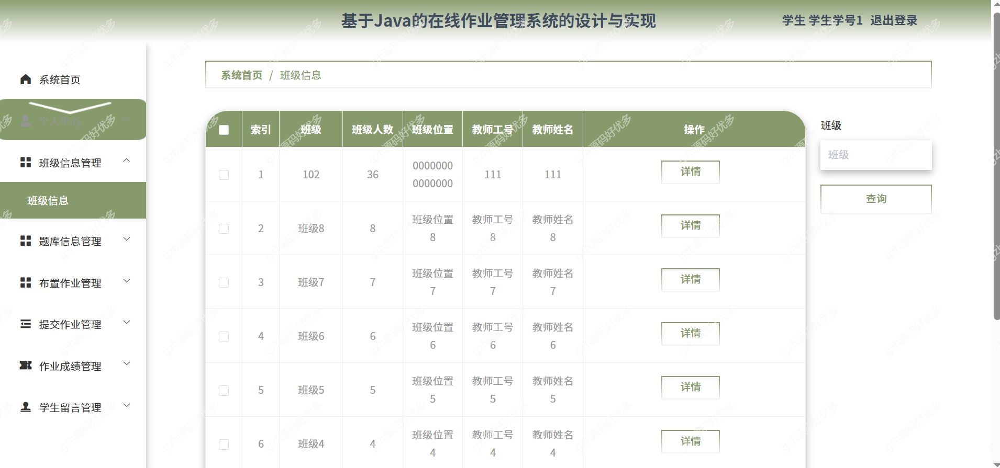
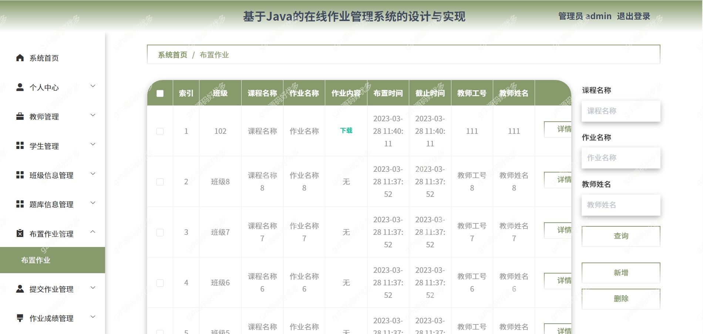
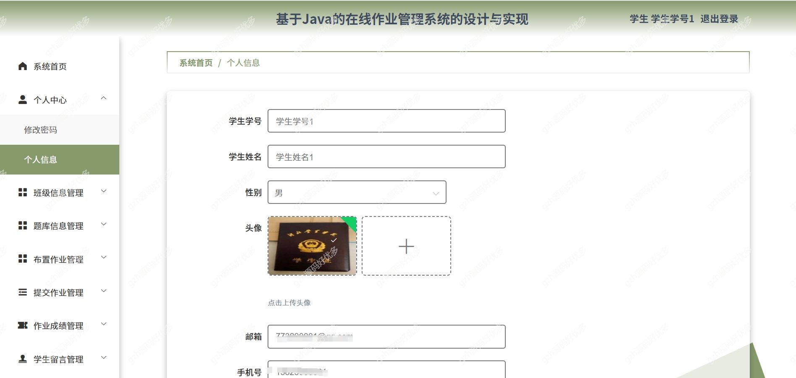
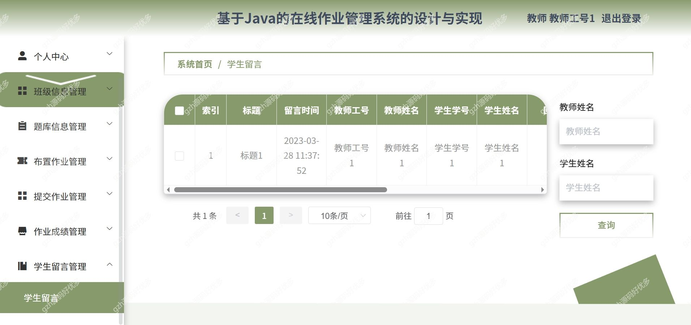
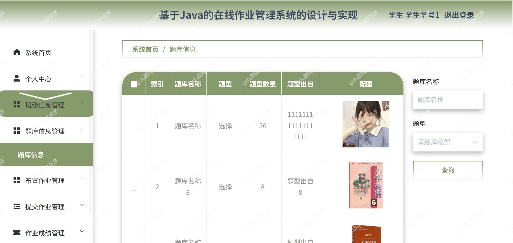
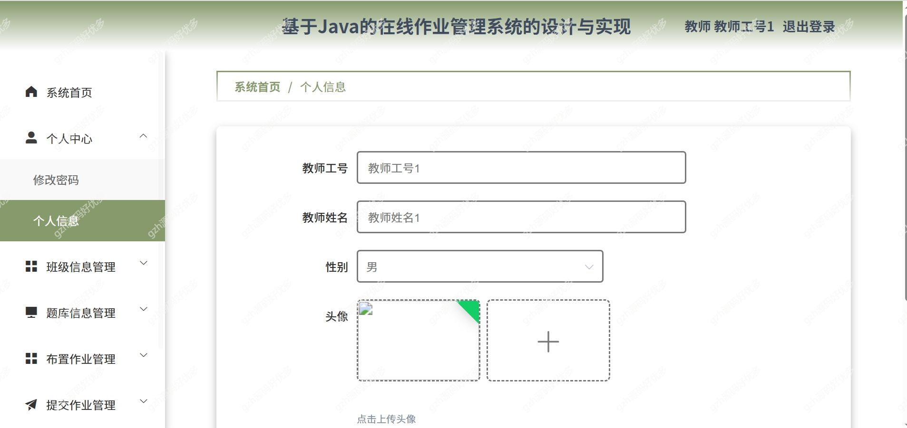

# springbootA321
springbootA321在线作业管理系统
 
## 查看主页获取源码

### 一、关键词
在线作业管理系统，作业系统

### 二、作品包含
源码+数据库+万字设计文档+PPT+全套环境和工具资源+本地部署教程

### 三、项目技术
前端技术：Html、Css、Js、Vue2.0、Element-ui 
后端技术：Java、SpringBoot2.0、MyBatis

### 四、运行环境（以下版本亲测，其他版本兼容性请自行测试）
开发工具：IDEA/eclipse  + VSCODE
数据库：MySQL5.7

数据库管理工具：Navicat10以上版本

环境配置软件： JDK1.8 + Maven3.6.3

前端Nodejs：14

浏览器：谷歌浏览器

### 五、项目介绍
项目编号：springbootA321

本在线作业管理系统是为了提高用户查阅信息的效率和管理人员管理信息的工作效率，可以快速存储大量数据，还有信息检索功能，这大大的满足了教师、学生和管理员这三者的需求

管理人员可以管理自己的教师、学生、班级信息、题库信息、布置作业、提交作业、作业成绩、学生留言等进行管理。

### 六、运行截图

